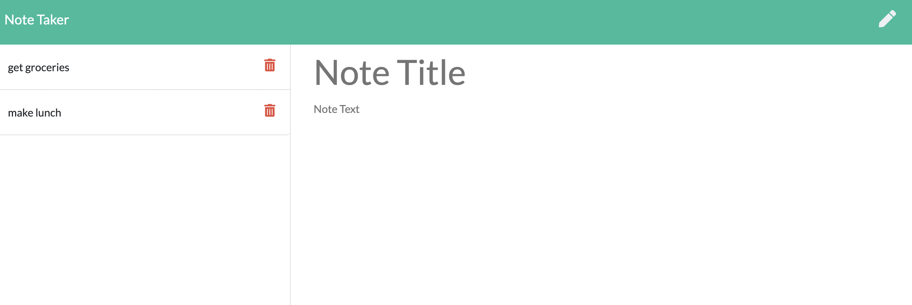

# Express.js: Note-Taker

## Description

This Note Taker can be used to write and save notes. This application uses Express.js back end and will save and retrieve note data from a JSON file. You can add notes, edit previous added notes, add new notes, and delete previous notes.

## Table of Contents

- [Installation](#installation)
- [Usage](#usage)
- [Credits](#credits)
- [License](#license)

## Installation/ ## Usage

https://github.com/erumd/Note-Taker

https://whispering-falls-96422.herokuapp.com/

Clone the above GitHub repo link and open it on your computer. You can also click on the Heroku link and open up the website to add notes, edit previous notes, add new notes, and delete previous notes.

## Questions

If you have any questions or would like to contribute you can view my GitHub account:
(https://github.com/erumd)
or email me erumdhukka531@gmail.com.

## License

MIT License

Copyright (C) 2021, Erum Dhukka

Permission is hereby granted, free of charge, to any person obtaining a copy
of this software and associated documentation files (the "Software"), to deal
in the Software without restriction, including without limitation the rights
to use, copy, modify, merge, publish, distribute, sublicense, and/or sell
copies of the Software, and to permit persons to whom the Software is
furnished to do so, subject to the following conditions:

The above copyright notice and this permission notice shall be included in all
copies or substantial portions of the Software.

THE SOFTWARE IS PROVIDED "AS IS", WITHOUT WARRANTY OF ANY KIND, EXPRESS OR
IMPLIED, INCLUDING BUT NOT LIMITED TO THE WARRANTIES OF MERCHANTABILITY,
FITNESS FOR A PARTICULAR PURPOSE AND NONINFRINGEMENT. IN NO EVENT SHALL THE
AUTHORS OR COPYRIGHT HOLDERS BE LIABLE FOR ANY CLAIM, DAMAGES OR OTHER
LIABILITY, WHETHER IN AN ACTION OF CONTRACT, TORT OR OTHERWISE, ARISING FROM,
OUT OF OR IN CONNECTION WITH THE SOFTWARE OR THE USE OR OTHER DEALINGS IN THE
SOFTWARE.
